<!-- 
_class: intro-blue 
_header: 
-->

# &nbsp;
# Zero to Hero with Portworx on AKS
### Peter Laudati | Cloud Solution Architect
#### Microsoft Corporation

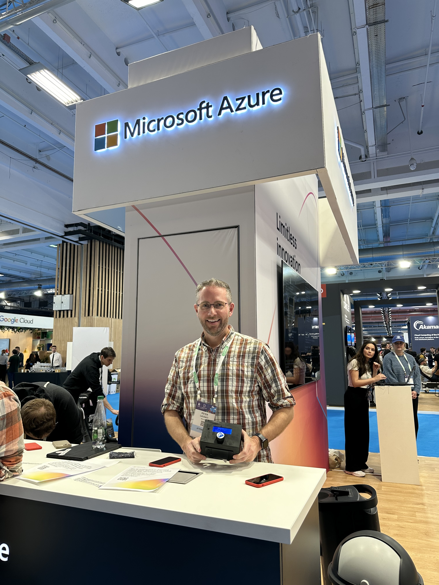

---

# Agenda

- Intro
- Overview
- Benefits
- How to Deploy
- Scenarios
- Q&A

---
# Me

- Cloud Solution Architect @ Microsoft
  - *Building Azure solutions since 2009!*
- Always mixing business with fun =>
- On a challenge to eat a meal in all 564 towns in New Jersey!
  - https://bit.ly/eatjersey


---

# Assumptions and Acronyms

100 level of:
- Azure
- Kubernetes (K8s)
- Portworx (PX)
- Azure Kubernetes Service (AKS)

---

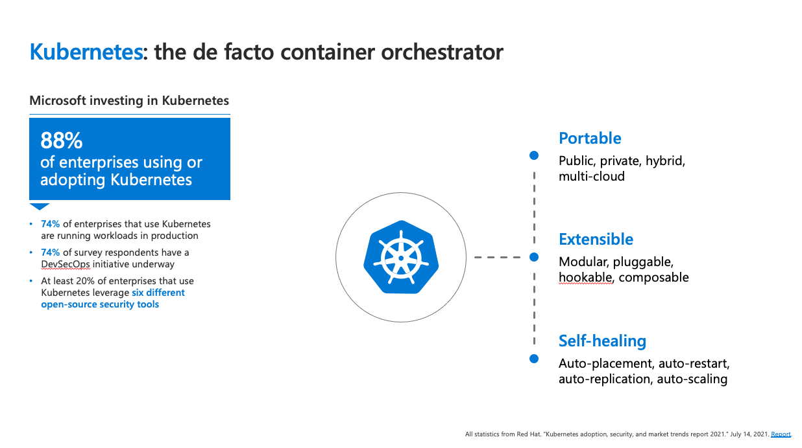

<!-- Do I really need to say this here in front of this crowd?! -->
<!-- We've gone FROM: Kubernetes being the shiny new toy.. -->
<!-- TO: WOW!  Kubernetes is 10 years old and almost everyone is using it! -->
---

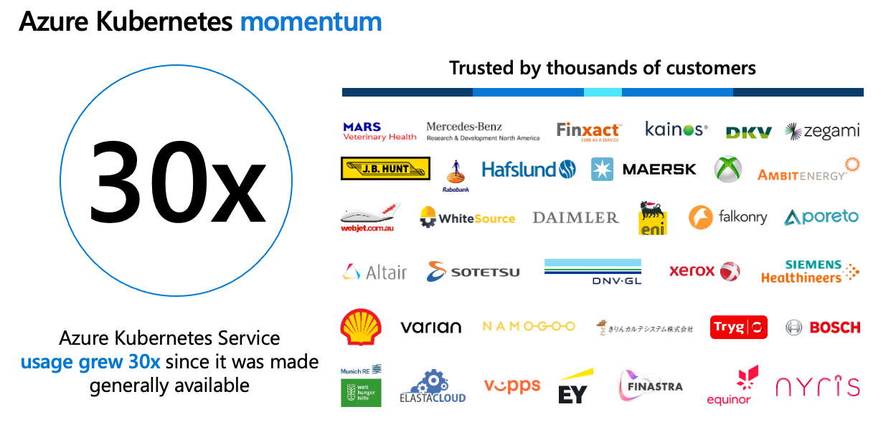

<!-- Since AKS came out in August 2018, it's become one of Microsoft's fastest growing services -->

---

# Azure Kubernetes Service

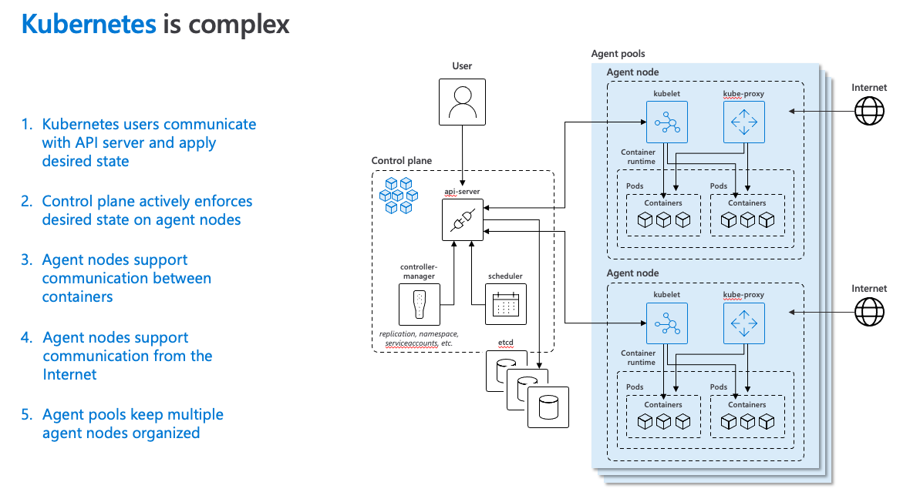

<!-- No matter how much we may be impressed with our knowledge of K8S.  -->
<!-- K8S is COMPLEX! -->
<!-- That's why, even with K8S at 10 years old and AKS at 7 years old, one of the most popular hackathons I run with my customers is the "Intro To Kubernetes" -->
<!-- It's where we introduce the entire concept of K8S, being a container orchestrator with its own jargon and vocabulary -- nodes, pods, services, ingress, and so on -->

---
# Azure Kubernetes Service

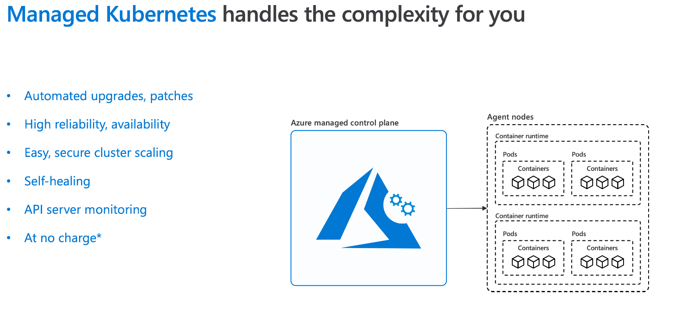

<!-- AKS, as a managed service, makes Kubernetes easier. -->
<!-- Over the years, it's gotten easier and easier with more of the operational tasks needed to manage a cluster being automated or simplified -->

<!-- One thing that's STILL a bit tricky on K8S is storage. -->
<!-- K8S was designed as a stateless platform, but that hasn't stopped people from hosting stateful workloads on it. -->
<!-- On Azure alone, there are at least 5 different ways of handling storage -->
<!-- You have to manage storage performance, redundancy, and worry about things like which nodes storage is attached to, or which availability zone storage is in, etc -->
<!-- This is TOO complex -->
---


# Portworx Enterprise

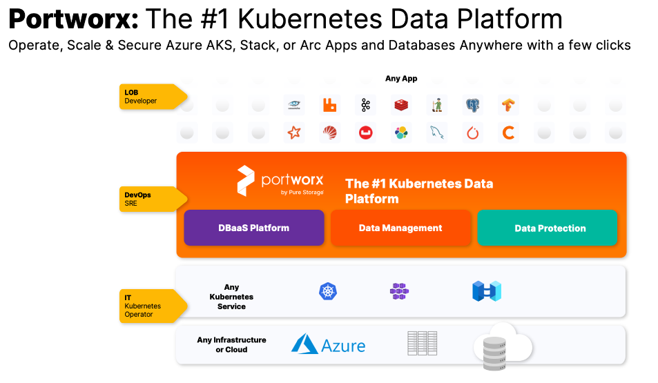

- K8s storage platform
- Enterprise grade
- Use Cases
  - DBaaS
  - SaaS with storage
  - Disaster Recovery
  - Cross-Cloud Migration

<!-- Introducing PortWorx -->
<!-- PortWorx makes handling storage of enterprise work loads EASY -->
<!-- all of those K8S storage complexities I mentioned are handled by PortWorx -->
---

# Benefits of PX on AKS

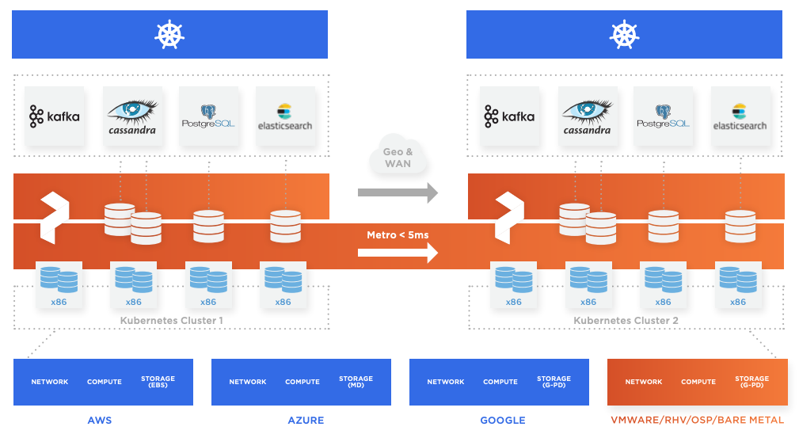

- Enterprise grade storage platform and managed K8s
- Storage configuration at pod level to meet SLA
- Backup and migrate across k8s clusters or even clouds!

<!-- With PortWorx on AKS, you get the addition of "managed storage" on your "managed K8S cluster" -->
<!-- Now you can configure storage at the pod-level and get the flexibility of managing it via the PortWorx -->
---

# Data Services

- Microsoft SQL Server (recently announced)
- Kafka
- Elasticsearch
- Cassandra
- MongoDB
- PostgreSQL
- MySQL
- and more

<!-- When I first started using K8S, folks told me... NEVER try running a Database in K8S, it's not designed for that. -->
<!-- Well, now you can! -->
<!-- PortWorx has built in support for running enterprise database workloads, including all of the ones listed here -->
---

# Install steps (0 to Hero steps)

```
# Create AKS Cluster
az group create -n portworx-aks -l southcentralus # 3sec
az aks create -g portworx-aks -n portworx-aks --enable-managed-identity # 3min
az aks get-credentials -g portworx-aks -n portworx-aks # 2sec

# Setup cluster
CLIENT_ID=$(az aks show -g portworx-aks -n portworx-aks --query identityProfile.kubeletidentity.clientId --output tsv)
OBJ_ID=$(az aks show -g portworx-aks -n portworx-aks --query identityProfile.kubeletidentity.objectId --output tsv)
az aks show -g portworx-aks -n portworx-aks --query nodeResourceGroup
MC_RG=$(az aks show -g portworx-aks -n portworx-aks --query nodeResourceGroup --output tsv)
az role assignment create --assignee-object-id $OBJ_ID --role "Contributor" --resource-group $MC_RG # 5 sec
kubectl create secret generic -n portworx px-azure --from-literal=AZURE_CLIENT_ID=$CLIENT_ID

# Install Portworx Operator + spec as per UI Instructions
kubectl apply -f 'https://install.portworx.com/2.13?comp=pxoperator&kbver=1.25.6&ns=portworx'
# Modify 2nd yaml as per Step #9 (remove AZURE_CLIENT_SECRET and AZURE_TENANT_ID)

```

Ref: https://docs.portworx.com/install-portworx/kubernetes/azure/aks/#install-portworx-on-aks-using-the-operator

<!-- Installing PortWorx on your AKS cluster is a breeze -->
<!-- (if you're good at copy/edit/pasting) -->
<!-- Here's a sample of the Azure CLI code to get you going -->
<!-- This deploys an AKS cluster, creates a managed identity for PortWorx, and then installs the PortWorx operator onto your cluster -->
<!-- After this, new PortWorx storage classes will show up in your cluster, and you can configure PVCs in your pod's YAML files -->

---

# AKS + Portworx Architecture

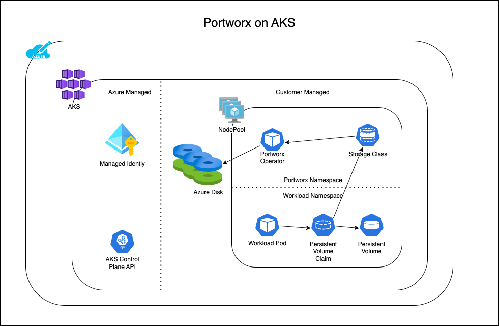

<!-- PortWorx operator creates/manages actual Azure storage resources behind the scenes -->
<!-- The operator then exposes that storage via a set of K8S StorageClasses -->
<!-- Applications can then use those storage classes and not have to worry about how they work under the covers -->

---

# Scenario: Wordpress on AKS + PX

### 43% of all websites on internet are built on Wordpress

```
Source: https://www.manaferra.com/wordpress-statistics
```

### Instructions
```
helm repo add bitnami https://charts.bitnami.com/bitnami
helm install px-wordpress bitnami/wordpress \
  --set global.storageClass=px-csi-db
```

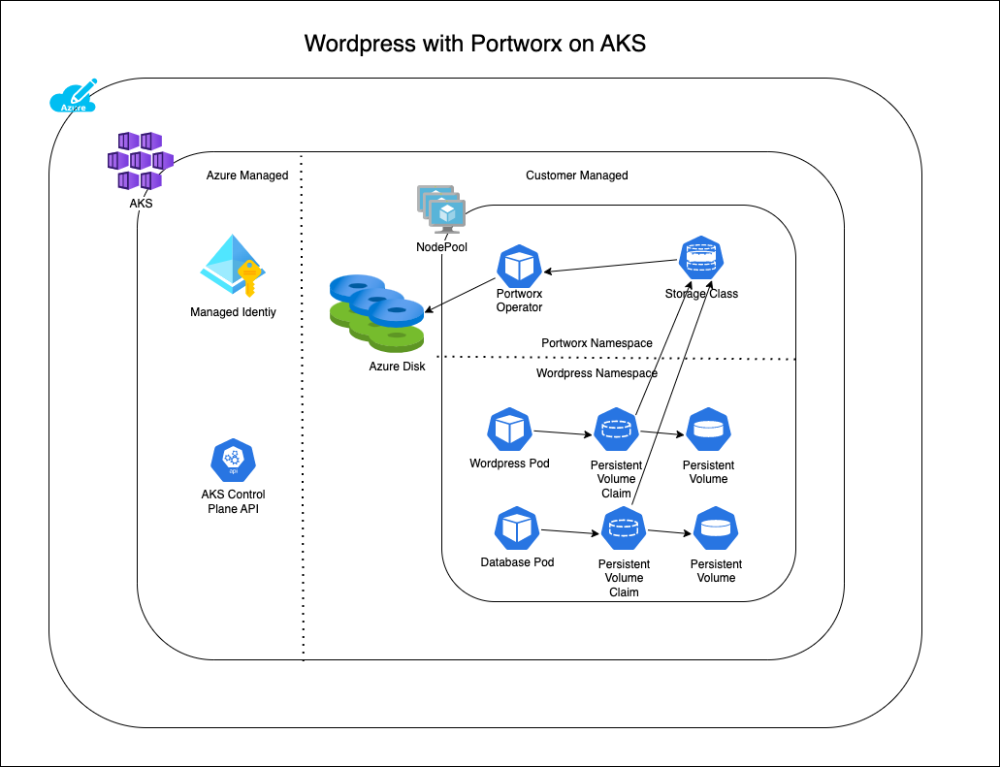

<!--


WordPress is pretty popular.  Let's use it as an example of what you can do with PortWorx.
Example:  Create a company offering WP as a Service.
Want to offer 1TB of storage to each customer
-->
---

# Scenario++: Storage Optimization

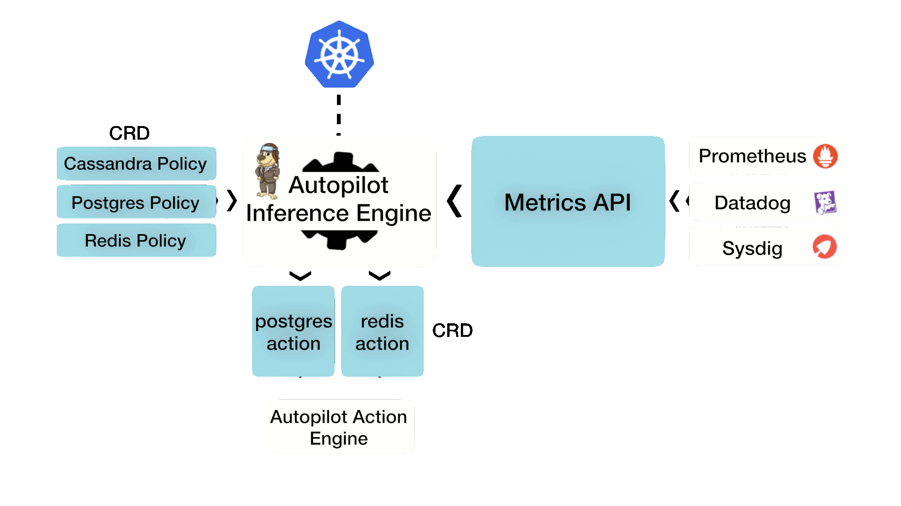

### Autopilot
- Save on storage costs
- Auto-rescale Portworx storage pools + PVC

<!-- 
Examples:
- Your WP website takes off and people start uploading content, Allocated 1TB, but many customers only using 10GB.

PortWorx can optimize your storage usage by auto-magically scaling up/down as needed!
It does this based on the observability metrics it collects.
-->

---

# Scenario++: Backup / Disaster Recovery

### Portworx Platform
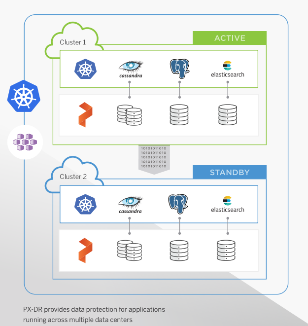

- Region fail over
- X-cloud or on-prem fail over
- Recovery from snapshop
<!--
PortWorx can handle all sorts of failover scenarios... whether between regions in Azure, or cross-cloud, or on-Prem!
it also handles back up.
REMINDER: Backup is NOT Disaster Recovery
-->
---
# Azure Marketplace

<!-- 
Part of K8s Apps in MP.  
Can deploy directly into AKS Cluster
-->

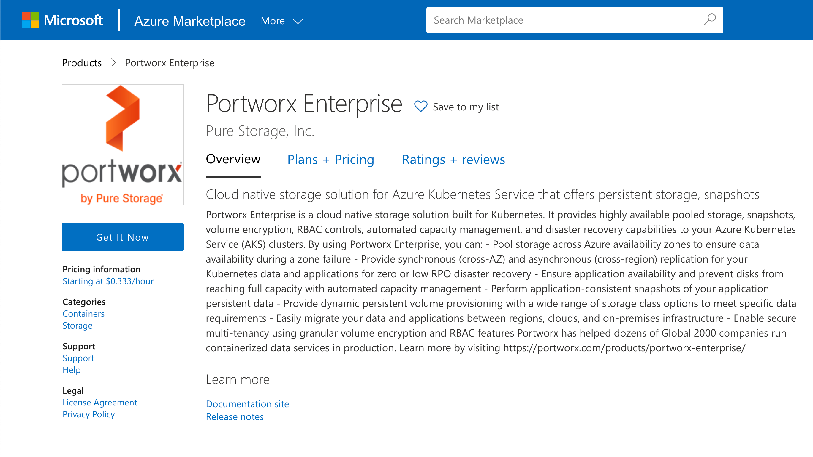


---

# Azure Marketplace - K8s Apps

<!-- 
Part of K8s Apps in MP.  
Can deploy directly into AKS Cluster
-->

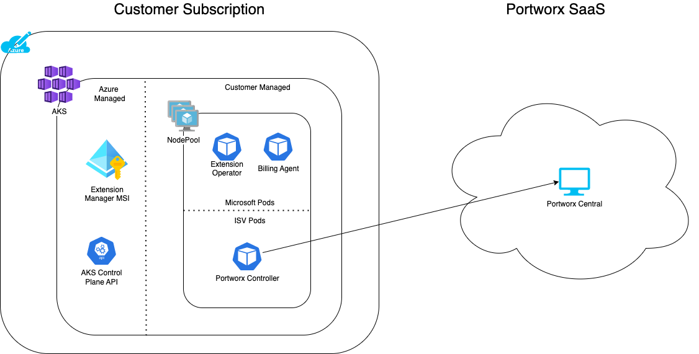


- New Marketplace Offer
- Deploy into AKS 
- Launch Partner: Portworx
 
---
<!-- 
_class: centered
_footer: Slides by Tommy Falgout: https://lastcoolnameleft.github.io/zero-to-hero-with-portworx-on-aks/
-->

# Thank you


